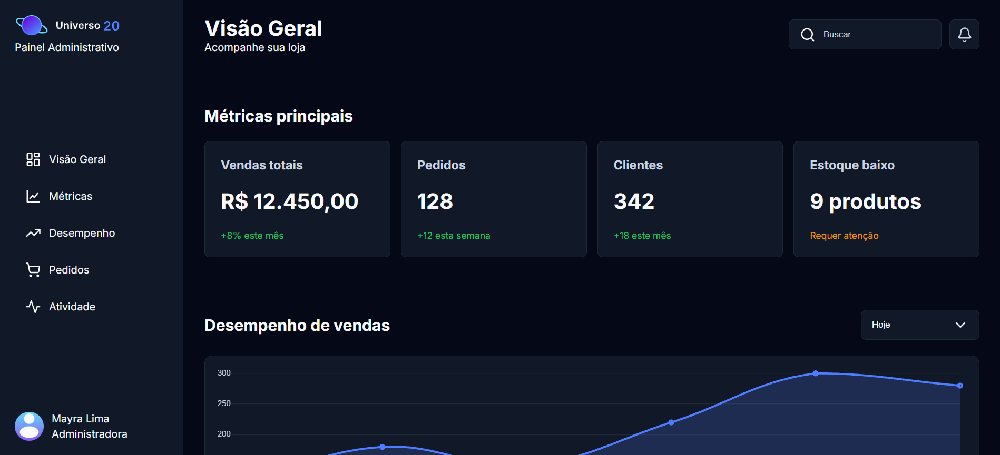

# Dashboard Administrativo

Dashboard administrativo desenvolvido para simular o painel de gerenciamento de uma loja virtual.

O projeto apresenta uma interface para acompanhamento de métricas, desempenho de vendas, pedidos recentes e atividades da loja, além de permitir a edição e exclusão de pedidos.

## 🚀 Demonstração

🔗 [Acessar projeto](https://dashboardadministrativomc.vercel.app/)

## 📸 Preview



## 🛠️ Tecnologias utilizadas

- HTML5
- CSS3
- JavaScript
- Chart.js
- Lucide Icons

## ✨ Funcionalidades

- Visualização de métricas principais
- Gráfico de desempenho de vendas
- Listagem de pedidos recentes
- Edição de pedidos
- Exclusão de pedidos com confirmação
- Busca de pedidos
- Atualização dinâmica dos dados
- Modal para edição de pedidos
- Modal de confirmação para exclusão
- Lista de atividades recentes
- Layout responsivo

## 📱 Responsividade

O dashboard foi desenvolvido para se adaptar a diferentes tamanhos de tela.

Foram utilizados Media Queries para reorganizar os elementos conforme a largura disponível, incluindo:

- Adaptação dos cards de métricas
- Ajuste do cabeçalho
- Redimensionamento do gráfico
- Adaptação da tabela de pedidos
- Scroll horizontal da tabela em telas menores
- Ajuste dos modais para dispositivos menores
- Adaptação da navegação lateral

O layout foi testado em diferentes larguras de tela para identificar problemas de overflow e garantir uma experiência consistente em dispositivos menores.

## 📂 Estrutura do projeto

```text
dashboard-administrativo/
│
├── assets/
│   └── images/
│       ├── Avatar.png
│       ├── Icone&favicon...
│       ├── Logo Horizontal...
│       └── preview.png
│
├── css/
│   ├── responsive.css
│   └── style.css
│
├── js/
│   └── main.js
│
└── index.html

💡 Sobre o projeto

Este projeto foi desenvolvido como uma aplicação prática de Front-End, simulando uma situação próxima do dia a dia de desenvolvimento de uma interface administrativa.

O foco foi construir uma interface organizada e funcional utilizando HTML, CSS e JavaScript, trabalhando tanto a estrutura visual quanto a interação dos elementos.

Durante o desenvolvimento foram implementadas funcionalidades de gerenciamento de pedidos, como edição e exclusão, utilizando JavaScript para manipular os dados e atualizar a interface dinamicamente.

🧠 Principais aprendizados

Durante o desenvolvimento do projeto, foram praticados conceitos como:

- Estruturação semântica com HTML
- Organização de layouts com CSS
- Flexbox e Grid
- Responsividade com Media Queries
- Manipulação do DOM
- Eventos em JavaScript
- Arrays de objetos
- Funções
- Condicionais
- Métodos de arrays
- Criação e manipulação de elementos dinamicamente
- Atualização da interface de acordo com os dados
- Implementação de modais
- Tratamento de interações do usuário
- Identificação e correção de problemas de overflow

🔧 Desafios técnicos

Um dos principais desafios durante o desenvolvimento foi adaptar uma interface originalmente projetada para desktop para telas menores.

Foi necessário identificar elementos que ultrapassavam a largura disponível e ajustar individualmente cards, gráfico, cabeçalho, tabela e modais.

Na tabela de pedidos, por exemplo, foi utilizado scroll horizontal em telas menores para preservar a estrutura das colunas sem comprometer a legibilidade das informações.

Os modais também precisaram ser adaptados para permanecerem centralizados e utilizáveis em telas menores.

📌 Próximos passos

Este projeto faz parte do processo de aprendizado e evolução em desenvolvimento Front-End.

Novas funcionalidades e melhorias poderão ser adicionadas conforme o avanço dos estudos.

👩🏻‍💻 Desenvolvido por

Mayra Lima

Front-End Developer em formação.